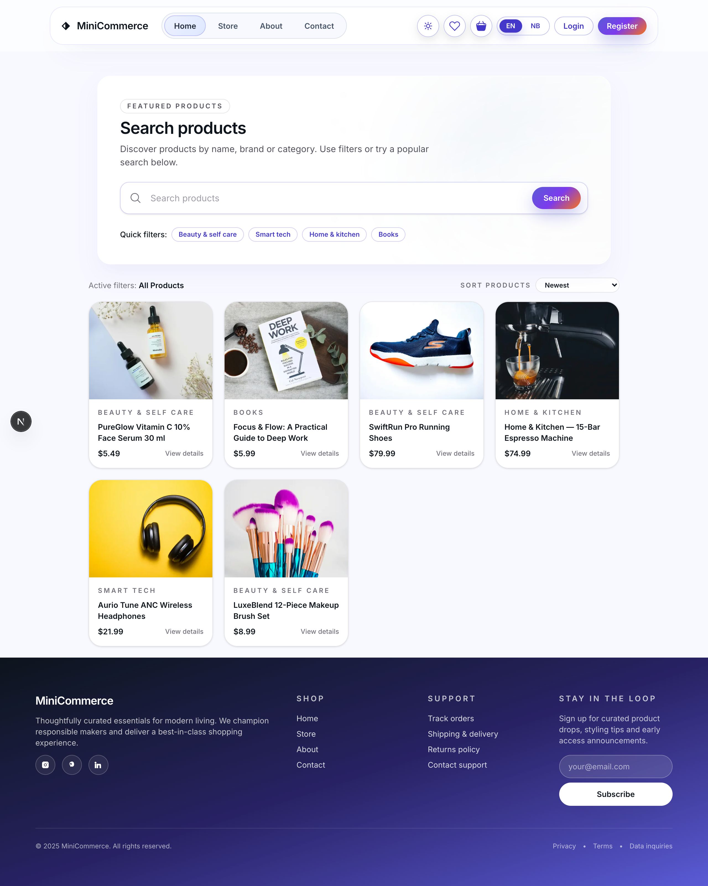
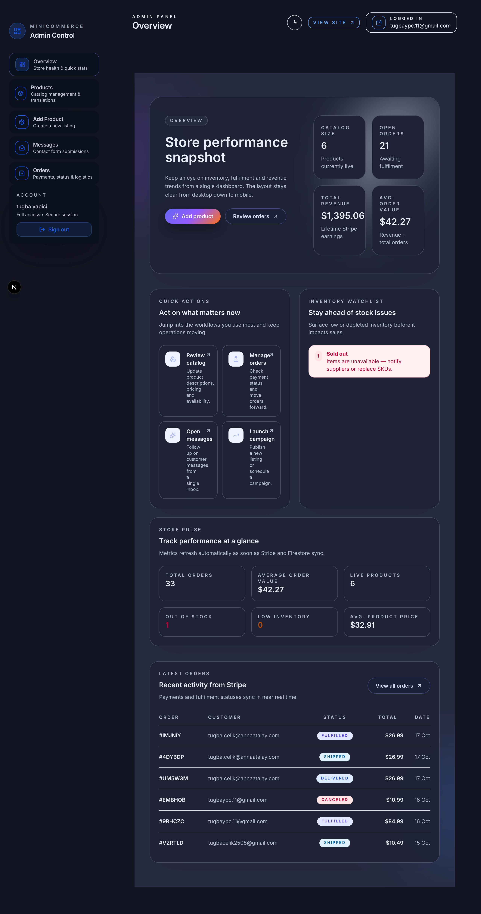
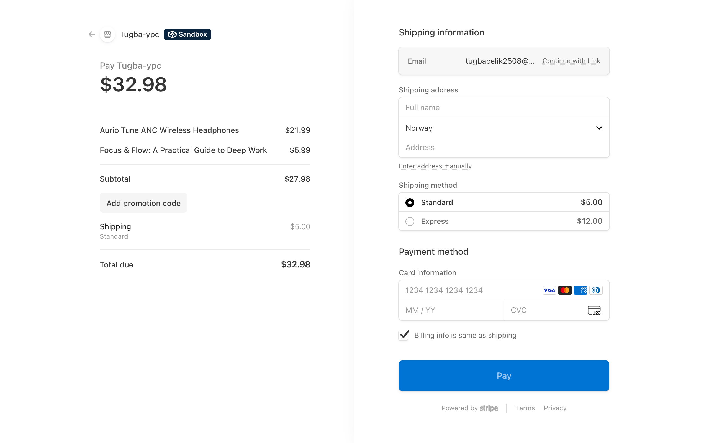
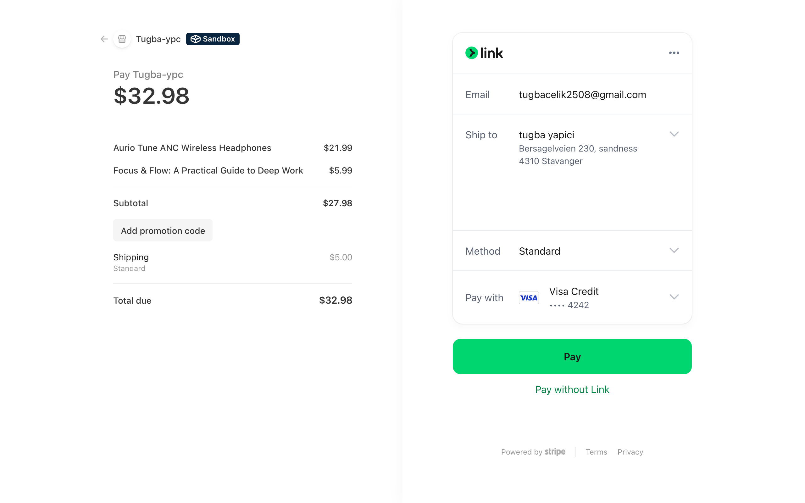

# 🛍️ MiniCommerce

_Modern, production-ready e-commerce starter built with Next.js App Router._

MiniCommerce delivers a polished shopper journey, role-based administration, and first-class integrations with **Firebase**, **Stripe**, **Vercel Blob**, and **Resend**. The project is structured to help teams launch quickly while keeping enterprise guardrails in place.

**🔗 Live Demo:** [mini-commerce-zeta.vercel.app](https://mini-commerce-zeta.vercel.app)

---

## 🚀 Highlights

- **End-to-end customer experience:** Faceted product discovery, localized content (EN/NB), wishlists, persistent cart, and Stripe Checkout.
- **Role-based admin workspace:** Inventory CRUD, order monitoring, contact message triage, and Firestore-backed access controls.
- **Resilient data model:** Cursor-based Firestore queries, normalized product helpers, and graceful fallbacks for missing indexes.
- **Operational guardrails:** Firebase Auth + Firestore roles, optional shared “admin secret”, email verification flow, and Resend-powered replies.
- **Excellent DX & UX:** Tailwind-based responsive UI, light/dark theming, schema.org metadata, and deterministic MSW-backed tests.

---

## 🖼️ Overview



> Elegant, modern storefront built with Next.js App Router and Tailwind CSS.  
> Users can explore products, apply filters, and enjoy seamless navigation.

---

## 🧱 Stack & Architecture

### 🖥️ Frontend

- **Next.js 15 (App Router)** + **React 19** + **TypeScript**.
- **Tailwind CSS v4** with global design tokens in `src/app/global.css`.
- State management via React Context (`src/context/AuthContext`, `CartContext`, `FavoritesContext`, `I18nContext`, `ThemeContext`).
- Pages and UI modules grouped under `src/app/**` and `src/components/**`.

### ⚙️ Serverless Backend

- App Router **route handlers** powering catalog, cart, checkout, admin CRUD, and Stripe webhooks (`src/app/api/**`).
- **Firebase Admin SDK** (`src/lib/firebaseAdmin.ts`) for trusted Firestore access.
- **Stripe SDK** (`src/lib/stripe.ts`, `src/app/api/checkout/route.ts`) for checkout sessions and admin-side product provisioning.
- **Resend** (`src/lib/resend.ts`) to turn admin replies into outbound emails.
- **Vercel Blob** (`src/app/api/admin/upload/route.ts`) for media uploads from the admin UI.

---

## 🧑‍💼 Admin Dashboard



> Role-based workspace for managing inventory, orders, and customer messages.  
> Features full dark theme support and real-time Stripe synchronization.

---

### 🗂️ Data Model

- Firestore collections: `products`, `orders`, `contactMessages`, `users`, and `users/{uid}/cartItems`.
- Type safety backed by `src/types/product.ts` and related interfaces.
- `firestore.indexes.json` defines the composite indexes required for category + price/sorting + localized titles.

---

## 📁 Project Structure

```
mini-commerce/
├─ src/
│  ├─ app/                # App Router routes (public, user, admin, API)
│  ├─ components/         # UI building blocks and feature modules
│  ├─ context/            # React context providers (auth, cart, favorites, i18n, theme)
│  ├─ i18n/               # Localization dictionaries (en, nb)
│  ├─ lib/                # Shared helpers (Firebase, Stripe, validation, money, env)
│  └─ types/              # Type definitions and enums
├─ tests/
│  ├─ app|components|lib  # Vitest + Testing Library suites
│  ├─ e2e/                # Playwright smoke tests
│  └─ mocks/              # MSW handlers and shared test setup
├─ public/                # Static assets (placeholder imagery, favicon, etc.)
└─ README.md
```

> IDEs such as VS Code or JetBrains detect the structure automatically. Tailwind IntelliSense is recommended.

---

## ⚡ Getting Started

### 1️⃣ Prerequisites

- Node.js **18.18+**
- npm **9+**
- Firebase project (Firestore + Authentication)
- Stripe account
- Optional: Resend API key, Vercel Blob token

### 2️⃣ Install

```bash
git clone <repo-url>
cd mini-commerce
npm install
```

### 3️⃣ Environment Variables

Create `.env.local` (clone to `.env.test` / `.env.e2e` if needed):

| Variable                                   | Required  | Purpose                                                                 |
| ------------------------------------------ | --------- | ----------------------------------------------------------------------- |
| `NEXT_PUBLIC_SITE_URL`                     | ✅ (prod) | Base URL for SEO and API fallbacks.                                     |
| `NEXT_PUBLIC_FIREBASE_API_KEY`             | ✅        | Firebase client credentials.                                            |
| `NEXT_PUBLIC_FIREBASE_AUTH_DOMAIN`         | ✅        | Firebase Auth domain.                                                   |
| `NEXT_PUBLIC_FIREBASE_PROJECT_ID`          | ✅        | Firebase project id (client).                                           |
| `NEXT_PUBLIC_FIREBASE_STORAGE_BUCKET`      | ✅        | Firebase storage bucket.                                                |
| `NEXT_PUBLIC_FIREBASE_MESSAGING_SENDER_ID` | ✅        | Messaging sender id.                                                    |
| `NEXT_PUBLIC_FIREBASE_APP_ID`              | ✅        | Firebase app id.                                                        |
| `NEXT_PUBLIC_ADMIN_EMAILS`                 | Optional  | Comma-separated admin email list (auto-promotes on first login).        |
| `FIREBASE_PROJECT_ID`                      | ✅        | Service account project id.                                             |
| `FIREBASE_CLIENT_EMAIL`                    | ✅        | Service account email.                                                  |
| `FIREBASE_PRIVATE_KEY`                     | ✅        | Service account private key (escape newlines as `\n`).                  |
| `STRIPE_SECRET_KEY`                        | ✅        | Server-side Stripe key.                                                 |
| `STRIPE_WEBHOOK_SECRET`                    | Webhook   | Secret for `/api/stripe/webhook`.                                       |
| `RESEND_API_KEY`                           | Optional  | Enables admin contact replies.                                          |
| `RESEND_FROM`                              | Optional  | Sender label (defaults to `MiniCommerce <no-reply@mini-commerce.dev>`). |
| `BLOB_READ_WRITE_TOKEN`                    | Optional  | Vercel Blob token for local uploads.                                    |
| `ADMIN_SECRET`                             | Optional  | Shared admin access token when Firebase Auth is unavailable.            |
| `VERCEL_PROTECTION_BYPASS`                 | Optional  | Header token for protected Vercel preview branches.                     |
| `E2E_BASE_URL`                             | Optional  | Base URL for Playwright (`http://localhost:3000`).                      |

💡 **Tip:** Copy `project_id`, `client_email`, and `private_key` directly from your Firebase service account JSON.

### 4️⃣ Run Locally

```bash
npm run dev
# open http://localhost:3000
```

### 5️⃣ Production Build

```bash
npm run build
npm run start
```

> On Vercel, configure the same environment variables and point your Stripe webhook to `/api/stripe/webhook`.

---

## 💳 Firestore & Stripe Setup

1. **Deploy indexes:**
   ```bash
   firebase deploy --only firestore:indexes
   ```
2. **Seed products:**
   - Use the admin panel (`/admin/product`), or
   - Add documents that match `src/types/product.ts` directly in Firestore.
3. **Register Stripe webhook:**
   ```bash
   stripe listen --forward-to localhost:3000/api/stripe/webhook
   ```
4. **Grant admin access:**
   - Add an email to `NEXT_PUBLIC_ADMIN_EMAILS`, **or**
   - Set `role: "admin"` on `users/{uid}` in Firestore.

---

## 🖼️ Vercel Blob Setup

1. **Enable Blob storage:** In your Vercel project dashboard, open _Storage → Blob_ and create or attach a Blob store.
2. **Local development:** Generate a token from _Storage → Blob → Tokens_ and add it to `.env.local` as `BLOB_READ_WRITE_TOKEN`. The upload route (`src/app/api/admin/upload/route.ts`) reads this token when running locally.
3. **Production deployment:** Once the Blob store is attached to your Vercel project, Vercel injects credentials automatically; you can omit `BLOB_READ_WRITE_TOKEN` in hosted environments.
4. **Admin workflow:** Product create/edit forms POST files to `/api/admin/upload`, which streams assets to Vercel Blob and returns a CDN-backed URL saved alongside the product.

---

## 💳 Checkout Flow (Stripe Integration)

| Step 1 – Review Order                         | Step 2 – Payment                                |
| --------------------------------------------- | ----------------------------------------------- |
|  |  |

> Secure, localized checkout powered by Stripe.  
> Synchronizes payment and shipping details directly with Firestore orders.

---

## 🧪 Testing & Quality

| Command                 | Description                                                          |
| ----------------------- | -------------------------------------------------------------------- |
| `npm run lint`          | ESLint (`next/core-web-vitals`) configuration.                       |
| `npm run test`          | Vitest + Testing Library with MSW mocks.                             |
| `npm run test:coverage` | Text + lcov coverage reports.                                        |
| `npm run test:e2e`      | Playwright smoke tests (requires `npm run dev` in another terminal). |

Example unit test:

```tsx
import { render, screen } from '@testing-library/react'
import ProductCard from '@/components/ProductCard'

test('renders product title', () => {
  render(<ProductCard title="Nordic Jacket" price={199} />)
  expect(screen.getByText(/Nordic Jacket/i)).toBeInTheDocument()
})
```

Keep the Playwright suite deterministic by maintaining API mocks under `tests/mocks`. Disable mocks if you prefer to hit live services in a staging environment.

---

## 🧭 Key Workflows

- **Catalog browsing:** `HomeClient` → `/api/products` → Firestore with locale-aware cursor management.
- **Cart & favorites:** `CartContext` + `FavoritesContext` synchronize `localStorage` with Firestore.
- **Checkout:** `/api/checkout` validates payloads with Zod, rehydrates product data from Firestore, then creates a Stripe Checkout Session.
- **Order management:** `/api/admin/orders` leverages Firebase Admin auth to back the dashboard.
- **Media uploads:** `/api/admin/upload` streams to Vercel Blob and stores product imagery.
- **Internationalization:** `src/i18n/en.ts`, `src/i18n/nb.ts`; extend the enum to add more locales.
- **Email replies:** `/api/admin/contact-messages/[id]/reply` sends outbound messages via Resend.

---

## ✅ Preflight Checklist

- [ ] Environment variables configured for client and server.
- [ ] Firestore indexes deployed.
- [ ] Sample catalog data and Stripe price mappings in place.
- [ ] Stripe webhook registered and verified.
- [ ] Admin users granted the correct roles.
- [ ] `npm run lint`, `npm run test`, and `npm run test:e2e` passing.
- [ ] Optional services (Resend, Vercel Blob) verified.

---

## 🛠️ Troubleshooting

| Problem                     | Resolution                                                                    |
| --------------------------- | ----------------------------------------------------------------------------- |
| Missing Firebase env vars   | Check server logs for `[firebase] Missing env` warnings; verify `.env.local`. |
| Firestore permission errors | Ensure the service account has Firestore + Auth permissions.                  |
| Stripe 401 responses        | Confirm `STRIPE_SECRET_KEY` and the account mode (test vs. live).             |
| Admin API 401/403           | Ensure the user has `role: "admin"` or provide the configured `ADMIN_SECRET`. |
| Dark theme not applying     | Verify `ThemeProvider` usage and design tokens in `global.css`.               |
| Flaky Playwright tests      | Reset handlers in `tests/mocks` and make sure the dev server is running.      |

---

## 🌙 Responsive & Theme Showcase

| Light Mode                            | Dark Mode (Mobile)                                       |
| ------------------------------------- | -------------------------------------------------------- |
|  |  |

> Fully responsive design built with Tailwind.  
> Adapts to screen size and theme preference seamlessly.

---

## 🤝 Contributing & Next Steps

- Add more locales by extending `src/i18n`.
- Refine product and order types in `src/types/product.ts` and related modules.
- Wire lint, test, and e2e commands into your CI/CD pipeline.
- Consider Firebase Emulator + Stripe CLI for a fully offline development stack.

MiniCommerce is designed to accelerate production-grade e-commerce launches. Fork it, experiment, and contribute—community improvements make the project stronger. ✨

---

## 📄 License

MIT © 2025 Tuğba Çelik

---

✨ **Happy shipping! 🚀**
